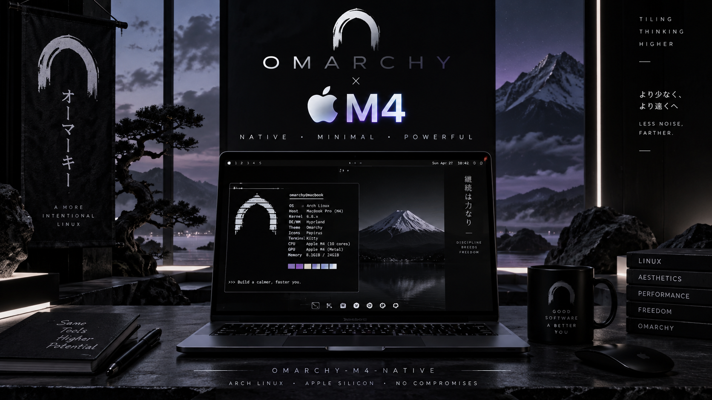

# Omarchy on the M4 MacBook Air — bring-up research

Experimental Linux device-tree patches, kernel changes, and research from an
attempt to run **Omarchy natively on a 13-inch M4 MacBook Air (2025)**.
Maintained by **KB2UKA** and shared so other Apple Silicon and Omarchy
enthusiasts can inspect, reproduce, and build on the findings.

**The milestone:** Linux reached a framebuffer console and a BusyBox shell
prompt on the Air with the storage and several other peripheral groups
disabled. **A working Omarchy desktop was not achieved.** This repository
contains the research and patches, not an installer, disk image, complete
kernel tree, or supported operating system.

## Project status

Hardware work took place around August 31–September 2, 2026. The project was
put on hold on September 2: accelerated graphics and audio were essential to
the intended daily-driver experience, and this work had not delivered them.
The third hardware session was prepared but **never run**. This public
handoff documents that checkpoint; publication does not mean testing resumed.

All results below describe **this project's recorded revisions and test
machine**, not the current support status of Asahi Linux or every M4 Mac.
Check the [Asahi M4 feature page](https://asahilinux.org/docs/platform/feature-support/m4/)
for upstream progress.

## Hardware and approach

| Item | Research target |
| --- | --- |
| Machine | MacBook Air, 13-inch, M4, 2025 |
| Model / board | `Mac16,12` / `J713` (board ID `0x2c`) |
| SoC | Apple `T8132`, M4 |
| Boot path | m1n1 USB proxy → experimental Asahi-derived Linux kernel → BusyBox initramfs |
| Display during bring-up | Boot framebuffer / simpledrm console |
| Proxy host | A separate Mac, with USB access to the target |
| Kernel build host | Separate Linux machine with an AArch64 LLVM toolchain |

The aim was bare metal. Virtual machines were outside the final project
scope. The initial roadmap is preserved in [SPEC.md](SPEC.md), dated to
avoid confusing the original ambitions with completed functionality.

## What we did

### 1. Mapped the hardware and extended the device trees

We compared the target's macOS IODeviceTree and live Apple Device Tree (ADT)
with the T8132 baseline and existing Asahi driver interfaces. Other Apple
SoCs supplied binding and driver precedents; they were not treated as proof
that the M4 used identical addresses, interrupts, or wiring.

Ten initial patch slices described storage/SMC, SPI, USB/ATC, SEP, SPMI/PMU,
Type-C, PCIe, MTP input transport, SIO, and AOP. Later patches addressed
findings from the first hardware session and the offline follow-up.

The detailed [gap analysis](docs/t8132-gap-analysis.md) records which values
came from the target, which came from a precedent, and which still need a
hardware test. A device-tree node existing or compiling does **not** establish
that its peripheral works.

### 2. Reached Linux on the actual Air

The recorded kernel was an Asahi-derived `7.1.9+` build. Reaching the console
required `idle=nop`, disabling the WFxT delay path, and bypassing particular
AIC EL2 register accesses in the experimental kernel. These are bring-up
hacks, not production-quality fixes: the patch disables paths broadly and
must not be treated as safe for other Apple machines or normal kernel use.

We also removed depopulated `atc2`/`atc3` power-manager domains on J713 after
they blocked progress. With the ANS/SART/NVMe group disabled, Linux printed
the board identity and reached a BusyBox `/ #` prompt on the internal panel.
The built-in keyboard was not working in that configuration, so the prompt
is evidence of reaching userspace, not of a usable interactive laptop.

### 3. Isolated the storage failure and prepared a candidate fix

Enabling the storage group produced a silent early boot wedge; disabling it
allowed the shell prompt. The offline investigation then found that the M4
uses separate NVMe controller and NVMMU register windows:

| Resource | ADT tuple | Linux physical address |
| --- | --- | --- |
| NVMe controller | ANS `reg[9]` | `0x4c5cc0000` |
| NVMMU | ANS `reg[3]` | `0x485cc0000` |

The earlier description pointed the controller at the NVMMU window. Patch
0013 separates them and uses `apple,t8132-nvme-ans2` without a generic fallback
that could bind an incompatible driver. Its companion kernel patch maps the
separate resource and adds the IO queue base writes at `0x1200` and `0x1208`,
following the M4 sequence studied in m1n1.

**This is a hardware-informed candidate fix, not a demonstrated storage
repair.** The modified driver was recorded as compiling, but the planned
boot to prove `nvme0n1` never happened. Mailbox operation, power sequencing,
and the intentional `0x28000` controller mapping beyond the ADT's `0x10000`
window remain subjects for validation. The DT and driver changes must be
reviewed together.

### 4. Audited the descriptions against the live ADT

The standalone Python tools compare MMIO ranges, IRQs, IOMMU stream IDs, and
power-manager relationships. The [recorded audit](docs/t8132-adt-audit.md)
reports 48 address-correlated `MATCH` rows, one intentional
`MATCH-OVERSIZE`, and two `DT-ONLY` rows after patch 0013. That summary applies
to the MMIO comparison; the report also documents unresolved PMGR differences
and other gaps. It is not an all-hardware-passed result.

The ADT also established USB stream IDs `1` and `14` and identified the
J713 HPM/USB-PD topology as SPMI rather than the initially suspected I2C path.
These findings improved the descriptions but did not establish working USB
or charging under Linux.

## What worked, and what did not

| Area | Evidence at the last checkpoint |
| --- | --- |
| m1n1 proxy boot | Observed on the target |
| Linux framebuffer console and BusyBox prompt | Observed with peripheral groups disabled |
| Depopulated ATC power-domain workaround | Recorded hardware finding; patch 0011 |
| NVMe / internal SSD under Linux | Candidate split-window fix compiled; hardware validation pending |
| USB / DART stream IDs | ADT-derived correction; end-to-end USB operation unverified |
| Keyboard and trackpad | MTP description added; input not demonstrated |
| SMC, charging, thermal management | Descriptions/preparation present; no daily-use validation |
| PCIe, Wi-Fi, Bluetooth | No demonstrated working Linux connectivity |
| GPU acceleration, accelerated desktop, audio | Not delivered by this project |
| SMP, suspend/resume, battery life, stability | Not validated; boot work used `nosmp` |
| Omarchy installer or desktop | Not built or demonstrated |

The original Air was restored to normal macOS operation at the end of the
hardware work. This is a historical outcome, not a guarantee that an
experimental boot attempt cannot affect a machine or its data.

## Repository map

| Path | Contents |
| --- | --- |
| [patches/](patches/) | Thirteen ordered Linux device-tree patches |
| [patches-kernel/](patches-kernel/) | Boot hacks and the proposed NVMe/NVMMU driver/binding change |
| [docs/t8132-gap-analysis.md](docs/t8132-gap-analysis.md) | Detailed derivations, session findings, and unresolved questions |
| [docs/t8132-adt-audit.md](docs/t8132-adt-audit.md) | Recorded offline audit and power-manager analysis |
| [docs/first-boot-runbook.md](docs/first-boot-runbook.md) | Historical first-session notes, including failed approaches and corrections |
| [docs/night3-runbook.md](docs/night3-runbook.md) | Staged but unexecuted incremental validation plan |
| [tools/adt.py](tools/adt.py) | Standalone binary ADT reader using Python's standard library |
| [tools/adt-audit.py](tools/adt-audit.py) | ADT versus compiled DTB comparison |
| [tools/mkdtb.sh](tools/mkdtb.sh), [tools/boot.sh](tools/boot.sh) | Historical Mac-host bench helpers; require adaptation and external assets |
| [recon/](recon/) | Derived PMGR description and capture availability notes |

The raw machine captures are withheld from the public tree because they
contain machine-specific identifiers. The original research and Git/PR history are preserved
privately. Public history starts from a clean research snapshot; old commit
identifiers in the notes refer to the historical work, not commits available
in this public repository. Published tables and derivations remain available; see
[recon/README.md](recon/README.md) for the resulting reproduction limits.

## Inspecting or reproducing the research

Start with the gap analysis, then the audit, then the night-3 plan. Read
later corrections before following any older command. The historical notes
contain machine-specific paths and observations; they are not a universal
installation guide.

```sh
git clone https://github.com/Kb2uka/Omarchy-M4-Native.git
cd Omarchy-M4-Native
```

For offline analysis, use your own locally captured ADT. Python 3.10 or later
is a conservative baseline for the bundled tools; no third-party Python
packages are required by these two analysis scripts.

```sh
python3 tools/adt.py /path/to/your-adt.bin /arm-io/ans
python3 tools/adt-audit.py --help
```

A DTB comparison additionally needs a compiled device tree and the matching
PMGR source. See the command and input descriptions in the audit document.
Do not upload an unreviewed capture: ADTs and IORegistry dumps can expose
serial numbers and other identifiers.

### Version and artifact limits

The notes record a device-tree checkout at `32be170d0`, later carrying the
local slices and follow-up commits, and a separate kernel build at
`77cb8f24c`. The repository does not vendor either tree. Those abbreviated
historical identifiers are provenance clues, not a promise that a fresh
upstream clone can resolve them or that the patch series applies to today's
branch. Confirm the exact base and patch applicability before building.

The series mixes plain unified diffs with mail-formatted patches. Use
`git apply --check` to assess each patch on the appropriate staged source;
do not assume the whole set can be consumed by `git am`.

Apply the numbered DT patches in order only against a compatible source
baseline. Do not assume an already-patched historical checkout needs the
whole series again. Do not apply the two kernel patches blindly to an
arbitrary kernel or use them on a production system.

Also absent are the built kernels, initramfs and its complete build recipe,
m1n1 sources/binaries, per-rung DTBs, full boot logs, photographs, and the
`reboot-probe.sh` helper expected by `tools/boot.sh`. Therefore **a clone is
not a complete reproducible boot kit**.

Both shell helpers preserve the original `~/omarchy-firstboot` layout.
`tools/mkdtb.sh` builds a DTB with clang and dtc and adds `/opt/homebrew/bin`
to its search path; adapt the source and tool paths for your host. It does
not select a proxy device.

The boot wrapper `tools/boot.sh` uses macOS `script` conventions and is not
supplied as a Linux or Windows boot wrapper. In that file, edit `DEV` to the
target's actual macOS USB proxy device before use. The helper sets
`M1N1DEVICE` from `DEV`, so an exported value cannot override its assignment.

For a direct call to m1n1's `tools/linux.py`, the
[historical first-boot runbook](docs/first-boot-runbook.md) shows how the Mac
session exported `M1N1DEVICE`. Use the device actually enumerated on your
proxy host, not the placeholder in these notes: macOS commonly uses
`/dev/cu.usbmodem*`, while Linux commonly uses `/dev/ttyACM*`. These notes do
not provide a Windows proxy setup.

Recovery/security changes and experimental internal-storage drivers warrant
a backed-up test machine and a recovery plan. Consult current Asahi and
Apple documentation before changing boot security. Nothing here should be
run as an unattended installer.

## Useful next work

1. Reconcile the old patches with current upstream work and recover or replace
   the exact source/build inputs.
2. Establish the minimal known-good console configuration again.
3. Test storage alone with the paired DT and driver change, capturing both
   successful probe output and failures. Split mailbox, SART, and NVMe into
   separate steps if the wedge remains.
4. Add SMC, MTP, and USB one group at a time, holding the kernel and boot
   arguments fixed during each comparison.
5. Validate power, input, connectivity, graphics, and audio before attempting
   an Omarchy desktop or installer.

For useful issue reports, include the board/SoC, exact source revisions,
patch list, kernel configuration, boot arguments, artifact hashes, and
redacted logs. Distinguish an offline derivation, a successful compile, and
an observed hardware result. Reports from another board are valuable but do
not establish J713 equivalence.

## Credits and related projects

Project work: **KB2UKA**. This research depends on the groundwork of the
[Asahi Linux contributors](https://asahilinux.org/),
[Linux kernel contributors](https://www.kernel.org/), and
[m1n1](https://github.com/AsahiLinux/m1n1). Their existing driver and
device-tree notices remain applicable. The historical boot investigation
also references Yureka's M4 work.

The intended desktop was [Omarchy](https://github.com/basecamp/omarchy).
[omarchy-mac](https://github.com/omarchy-mac/omarchy-mac) is related work at
the distribution/integration layer. This repository is an independent
experiment, not an official release or endorsement by those projects.
Upstream projects have their own contribution requirements; publication here
does not establish that these experimental patches are ready for submission.

## Licensing

This is a mixed-license repository. See [LICENSE.md](LICENSE.md) for the
file-by-file scope and [THIRD_PARTY_NOTICES.md](THIRD_PARTY_NOTICES.md) for
upstream attribution. Full license texts are in [LICENSES/](LICENSES/).
Original standalone tools and prose are MIT-licensed; DT work preserves
`GPL-2.0-or-later OR MIT`; Linux code changes retain their source-file GPL
terms, and the NVMe binding retains its dual license. No license here grants
rights to Apple firmware, macOS, trademarks, or separately obtained binaries.
